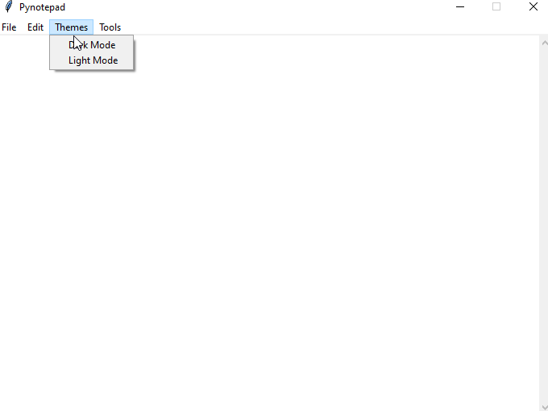
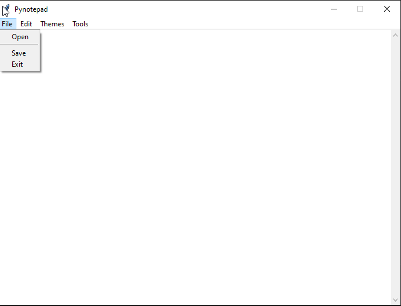
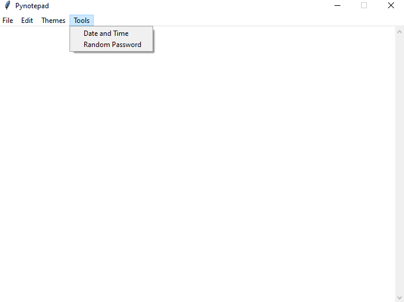
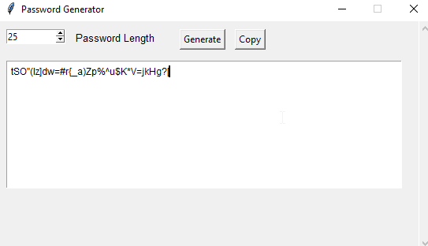
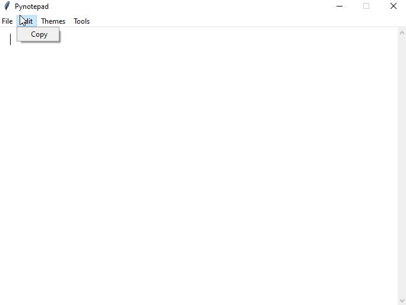
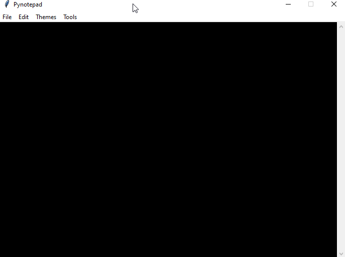

# Interactive Notepad

An interactive notepad with additional features for managing passwords, display modes, and more.

## Table of Contents
- [Introduction](#introduction)
- [Features](#features)
  - [File](#file)
  - [Edit](#edit)
  - [Theme](#theme)
  - [Tools](#tools)
- [Screenshots](#screenshots)
- [System Requirements](#system-requirements)
- [Contribution](#contribution) 
- [License](#license)

## Introduction

This project is an interactive notepad developed with Tkinter that goes beyond basic functions by including features such as password management, display modes, and more.

## Features

### File
- **Open:** Allows opening an existing file.
- **Save:** Saves the current content to a file.
- **Close:** Closes the notepad.

### Edit
- **Copy All:** Copies all content of the notepad to the clipboard.

### Theme
- **Light Mode:** Changes the interface to a light theme.
- **Dark Mode:** Changes the interface to a dark theme.

### Tools
- **Generate Passwords:** Opens a window for generating passwords.
  - **Generate:** Creates a random password.
  - **Copy:** Copies the password to the clipboard.
- **Date and Time:** Adds the current date and time to the notepad.

## Screenshots

## System Requirements
You dont need external libraries for execute this project. It was made only with standard libraries.

## Contribution
Chatme on discord: **782631037775118347**  **Angel of Death**

